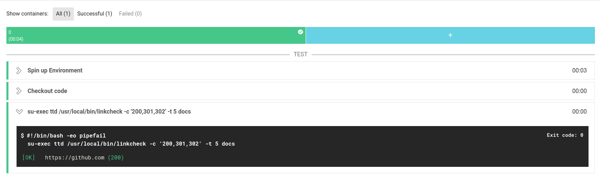
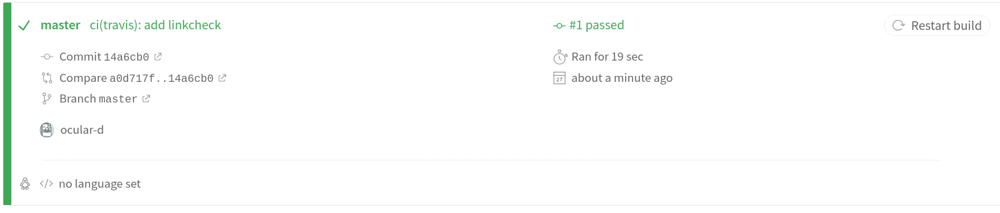
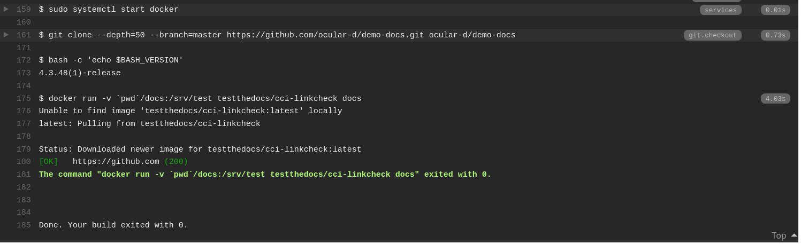
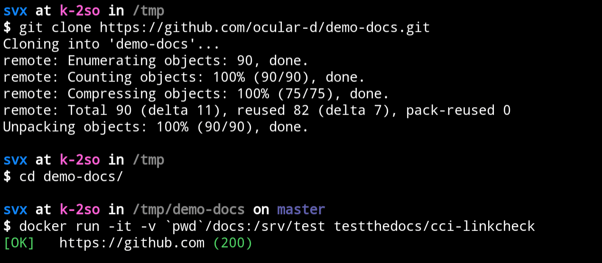

# Linkcheck

::: tip Scope
:bulb: Linkchecker for [Mardown](https://en.wikipedia.org/wiki/Markdown "Link to Markdown page on Wikipedia") (.`md`)
and [reStructuredText](https://en.wikipedia.org/wiki/ReStructuredText "Link to rst page on Wikipedia") (.`rst`) source files.
:::

**Table of content**

[[toc]]

## Continuous integration

### CircleCI

[CircleCI](https://circleci.com/features "Link to CirecleCI site") is a cloud-based continuous integration server.

It’s a hosted solution designed to reduce as much overhead as possible from the testing process.



Below is an example CircleCI pipeline (`.circleci/config.yml`) running linkcheck against the *docs* directory.

```yaml
---
version: 2

jobs:
  "linkcheck":
    docker:
        - image: testthedocs/cci-linkcheck:0.0.2
    steps:
      - checkout
      - run:
          command: |
            su-exec ttd /usr/local/bin/linkcheck -c '200,301,302' -t 5 docs


workflows:
  version: 2
  btd:
    jobs:
      - "linkcheck"
```

For more information about the configuration, please check the [CircleCI documentation](https://circleci.com/docs/ "Link to CircleCI docs").

### Travis CI

[Travis CI](https://travis-ci.com/ "Link to Travis CI site") is a hosted continuous integration service used to build and test software projects hosted at [GitHub](https://github.com "Link to GitHub site").





Below is an example Travis pipeline (`.travis.yml`) running linkcheck against the *docs* directory.

```yaml
---
language: generic
dist: xenial

services:
  - docker

stages:
  - test


jobs:
  include:
    - stage: test
      script:
      - docker run -v `pwd`/docs:/srv/test oculard/linkcheck docs
```

For more information about the configuration, please check the [Travis CI documentation](https://docs.travis-ci.com/ "Link to Travis docs").

### Drone

[Drone](https://drone.io "Link to Drone site") is a self-service Continuous Delivery platform.


Below is an example Travis pipeline (`.drone.yml`) running linkcheck against the *docs* directory.

```yaml
kind: pipeline
name: default

steps:
- name: linkcheck
  image: testthedocs/oculard-linkcheck
  commands:
    - su-exec ttd /usr/local/bin/linkcheck -c '200,301,302' -t 5 docs
```

For more information about the configuration, please check the [Drone documentation](https://docs.drone.io/ "Link to Drone docs").

## Settings

As default linkcheck allows the following [HTTP status codes](https://developer.mozilla.org/en-US/docs/Web/HTTP/Status "Link to site with HTTP status codes")

- `200 OK`
- `301 Moved Permanently`
- `302 Found`

Check for `localhost` and `127.0.0.1` are ignored.

```shell
RL_REGEX_EXCLUDE="^http(s)?:\\/\\/(127\\.0\\.0\\.1)|(localhost).*$"
```

Settings are configured in the [script itself](https://github.com/testthedocs/rakpart/blob/master/ttd-linkcheck/linkcheck "Link to source of script").

```txt
Usage: linkcheck [-e -i -t -r -c -k -l] [<path>]
       linkcheck --version
       linkcheck --help


Options:

-e        Limit search to those file extensions.
          Defaults to limiting on non-binary files.
          Accepts comma separated string of extensions:
            -e txt
            -e txt,rst
            -e sh,py.c,h

-i        Ignore all URLs matching the specified regex.
          Defaults to: ^http(s)?:\/\/(127\.0\.0\.1)|(localhost).*$
          Accepts a single regex string:
            -i '^http(?):\/\/my-comapny.com.*$'

-t        Specify curl timeout in seconds, after which probing stops for one url.
          Defaults to 10 seconds.
          Accepts a positive integer:
            -t 5
            -t 10

-r        Specify how many time to retry probing a single URL, before giving up.
          Defaults to 3 times.
          Accepts a positive integer:
            -r 5
            -r 10

-c        Specify HTTP status codes that are valid for success.
          Any code not specified in here will produce an error for the given URL.
          Defaults to '200'.
          Accepts comma separated string of http status codes:
            -c '200'
            -c '200,301'
            -c '200,301,302'

-k        Ignore invalid SSL certificates for HTTPS connections.
          Defaults to error on invalid SSL certificates.
          This is just a single flag with no other arguments.

-l        Specify whether to follow redirect URLs or not.
          This argument does not accept parameters.
          Defaults to not following redirects.

--version Show version and exit.
--help    Show this help screen.


Optional arguments:

<path>    Specify what directory to scan files for URLs.
          Defaults to current directory.
```

## Local usage

To use linkcheck locally, please make sure that you have [Docker](https://docker.com "Link to website of Docker") installed.

### Example

Check out the [demo-docs](https://github.com/ocular-d/demo-docs "Link to dem-docs repository") repository:

```shell
git clone https://github.com/ocular-d/demo-docs.git
```

Change into the cloned repository:

```shell
cd demo-docs
```

Run linkcheck:

  ```shell
  docker run -it -v `pwd`:/srv/test oculard/linkcheck
  ```



## Information

linkcheck is based on [cytopia/linkcheck](https://github.com/cytopia/linkcheck "Link to linkcheck website").

### Dependencies

- [Docker](https://docker.com "Website of Docker")