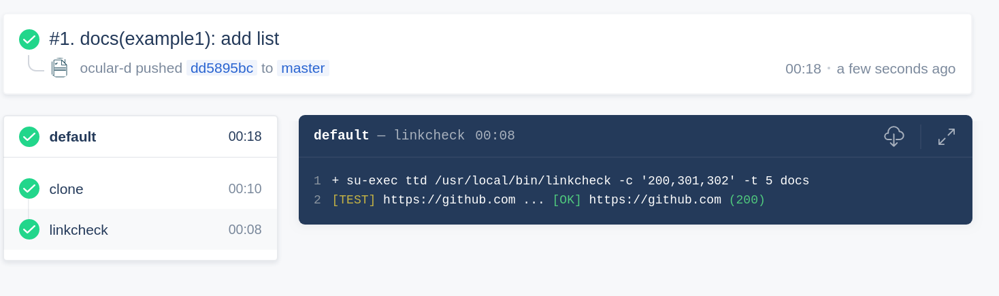

# Remark

::: tip Scope
:bulb: [Markdown](https://en.wikipedia.org/wiki/Markdown "Link to Markdown page on Wikipedia") code style linter for [CommonMark](https://commonmark.org/ "Link to website of CommonMark").
:::

**Table of content**

[[toc]]

## Continuous integration

### CircleCI

[CircleCI](https://circleci.com/features "Link to CirecleCI site") is a cloud-based continuous integration server.

It’s a hosted solution designed to reduce as much overhead as possible from the testing process

### Travis CI

[Travis CI](https://travis-ci.com/ "Link to Travis CI site") is a hosted continuous integration service used to build and test software projects hosted at [GitHub](https://github.com "Link to GitHub site").

### Drone

[Drone](https://drone.io "Link to Drone site") is a self-service Continuous Delivery platform.



Below is an example Travis pipeline (`.drone.yml`) running linkcheck against the *docs* directory.

## Local usage

To use linkcheck locally, please make sure that you have [Docker](https://docker.com "Link to website of Docker") installed.

### Example

Check out the [demo-docs](https://github.com/ocular-d/demo-docs "Link to dem-docs repository") repository:

```shell
git clone https://github.com:ocular-d/demo-docs.git
```

Change into the cloned repository:

```shell
cd demo-docs
```

## Information

remark is based on [remark-lint](https://github.com/remarkjs/remark-lint "Link to website of remark-lint") and [zemanlx/remark-lint](https://github.com/zemanlx/remark-lint "Website of zemanlx/remark-lint docker").

### Dependencies

- [Docker](https://docker.com "Website of Docker")
